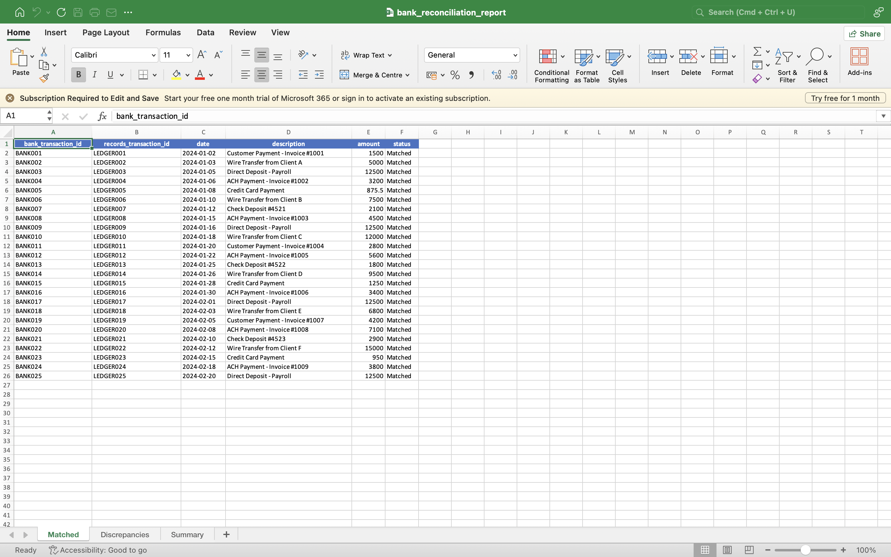
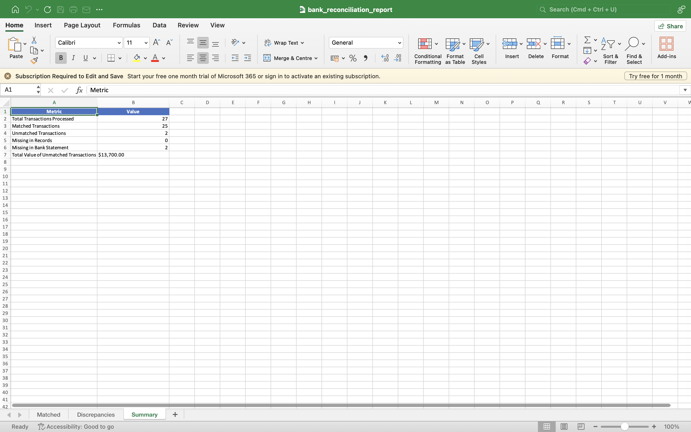
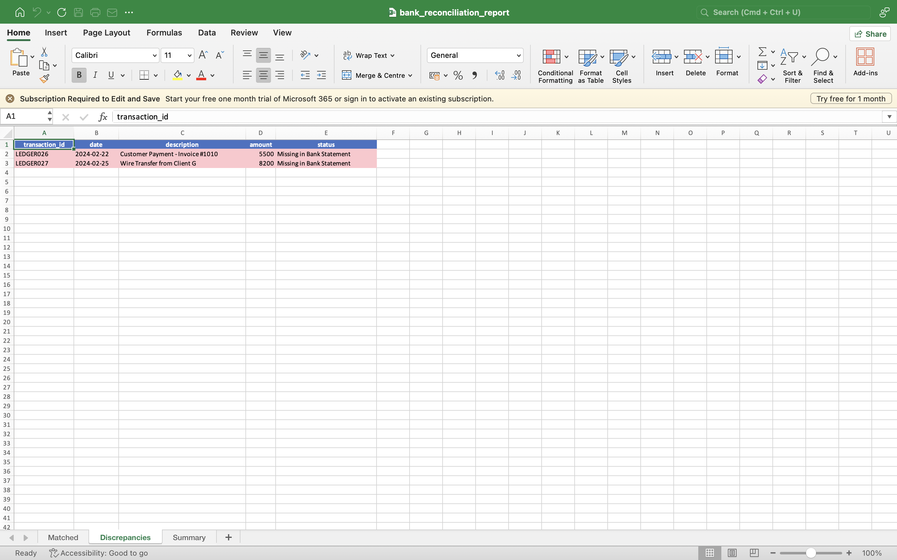

# Financial Record Checker

A Python command-line tool that automates the comparison of bank statement transactions against internal records to identify discrepancies and ensure accurate financial settlement.

---

## What It Does

This tool performs transaction reconciliation by:

1. **Loading Data** – Reads two CSV files:
   - `bank_statement.csv` (actual bank transactions)
   - `internal_records.csv` (company's internal records)

2. **Matching Transactions** – Compares transactions using:
   - Exact amount matching
   - Date matching with a **±1 day tolerance** to handle posting delays

3. **Classifying Results**
   - ✅ **Matched** – Transaction exists in both files
   - ❌ **Missing in Records** – Exists in bank statement but not in internal records
   - ❌ **Missing in Bank Statement** – Exists in internal records but not in bank statement

4. **Generating Reports** – Creates an Excel workbook containing:
   - **Matched** transactions
   - **Discrepancies** (highlighted in red)
   - **Summary** sheet with reconciliation statistics

---

## Real-World Use Cases

This project can be used for:

- Daily and monthly **bank reconciliation**
- Detecting missing or duplicate transactions
- Verifying payment settlements
- Supporting financial audits
- Improving cash flow monitoring
- Identifying data-entry or processing errors

---

## Installation

Install the required packages:

```bash
pip install pandas openpyxl
```

---

## Usage

### Run with Sample Data

```bash
python reconcile.py
```

Default files:

- **Input**
  - `bank_statement.csv`
  - `internal_records.csv`

- **Output**
  - `bank_reconciliation_report.xlsx`

---

### Run with Custom Files

```bash
python reconcile.py --bank custom_bank.csv --records custom_records.csv --output custom_report.xlsx
```

---

## Command-Line Arguments

| Argument | Description | Default |
|----------|-------------|---------|
| `--bank` | Bank statement CSV | `bank_statement.csv` |
| `--records` | Internal records CSV | `internal_records.csv` |
| `--output` | Output Excel report | `bank_reconciliation_report.xlsx` |

---

## Input File Format

Both CSV files should contain the following columns:

| Column | Description | Example |
|---------|-------------|---------|
| `transaction_id` | Unique transaction ID | `BANK001` |
| `date` | Transaction date (`YYYY-MM-DD`) | `2024-01-02` |
| `description` | Transaction description | `Customer Payment - Invoice #1001` |
| `amount` | Transaction amount | `1500.00` |

---

## Sample Data

The repository includes sample datasets containing synthetic financial transactions.

- **bank_statement.csv** – 25 transactions
- **internal_records.csv** – 27 transactions (includes 2 unmatched records)

These datasets intentionally contain discrepancies to demonstrate the reconciliation process.

---

## Output

The tool generates:

### Console Summary

Displays reconciliation statistics directly in the terminal.

### Excel Report

The Excel workbook includes:

- Matched Transactions
- Discrepancies Report
- Summary Sheet
- Blue formatted headers
- Red highlighted unmatched records
- Auto-adjusted column widths

---

## Example Output

```text
============================================================
Bank Transaction Reconciliation Tool
============================================================

Loading bank statement from: bank_statement.csv
Loading internal records from: internal_records.csv

Bank statement: 25 transactions
Internal records: 27 transactions

Matching transactions...

============================================================
RECONCILIATION SUMMARY
============================================================
Total Transactions Processed: 52
Matched Transactions: 25
Unmatched Transactions: 2
  - Missing in Records: 0
  - Missing in Bank Statement: 2
Total Value of Unmatched Transactions: $13,700.00
============================================================

Generating Excel report...
Excel report saved to:
bank_reconciliation_report.xlsx

Reconciliation complete!
```

---

## Screenshots

### Matched Transactions



---

### Reconciliation Summary



---

### Discrepancies Report



---

## How It Works

### Date Tolerance

Transactions are matched within a **±1 day window** to account for bank posting delays.

Example:

- Internal Record: **2024-01-15**
- Bank Statement: **2024-01-16**

These are still considered a valid match.

### Amount Matching

Transactions must have the **same amount**.

### One-to-One Matching

Each transaction can only be matched once, preventing duplicate matches.

### Reporting

Every transaction is classified and included in the final reconciliation report.

---

## Error Handling

The tool validates:

- Required columns are present
- Dates are correctly formatted
- Input files exist and are readable

Clear error messages are displayed if validation fails.

---

## Technologies Used

- Python
- Pandas
- OpenPyXL

---

## Project Structure

```text
Financial-Record-Checker/
│
├── reconcile.py
├── bank_statement.csv
├── internal_records.csv
├── README.md
├── requirements.txt
├── screenshots/
│   ├── matched_transactions.png
│   ├── reconciliation_summary.png
│   └── discrepancies_report.png
└── bank_reconciliation_report.xlsx
```

---

## License

This project is intended for educational and portfolio purposes.